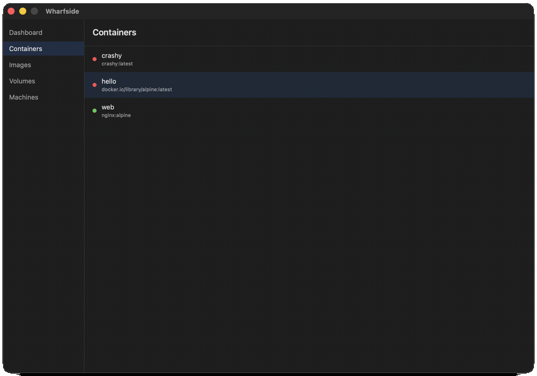
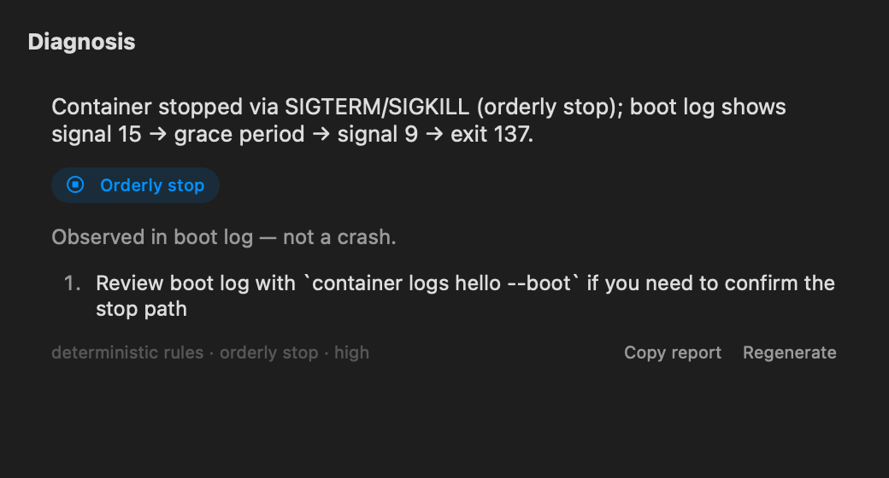
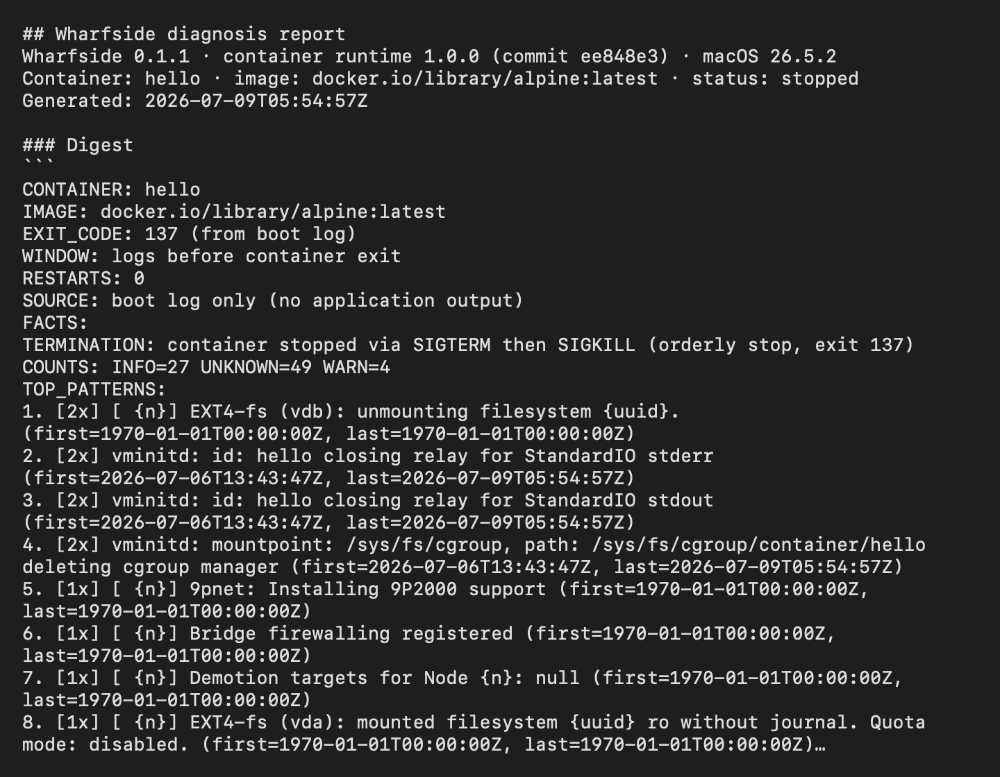
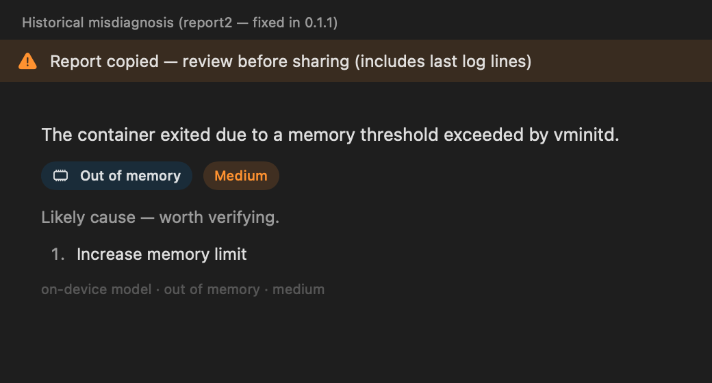
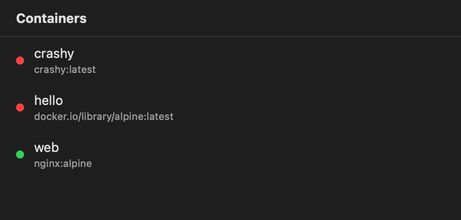
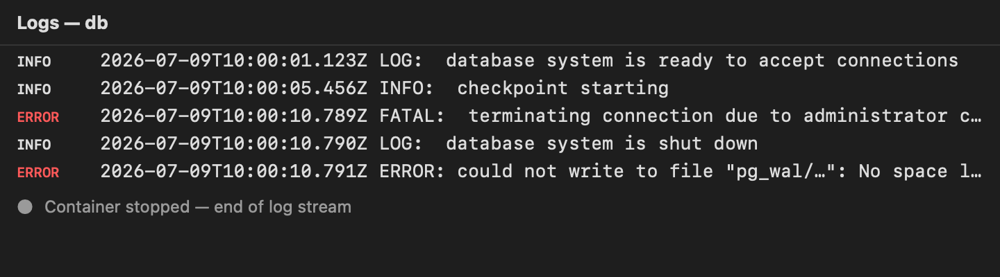
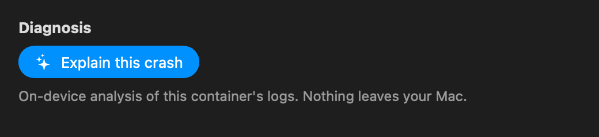
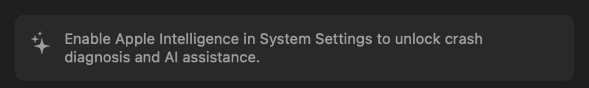

# Wharfside

[](https://github.com/wharfside/wharfside/actions/workflows/ci.yml)

**Wharfside explains why your containers crashed — on-device AI diagnosis for
Apple's [`container`](https://github.com/apple/container) runtime, native on macOS.**

One click on a dead container produces a root-cause diagnosis: what killed it,
how confident the answer is, and what to do next. Analysis is fully on-device
(Apple's [Foundation Models](https://developer.apple.com/documentation/foundationmodels)) —
no API keys, no cloud, and your logs never leave your Mac.



## The bug that shaped the architecture

Early on, a user stopped a container normally: SIGTERM, a 10-second grace
period, SIGKILL, exit 137. Wharfside diagnosed it as out-of-memory. Confidently.

The root cause: the runtime's init daemon logs a `memory threshold exceeded`
line on *every boot*, regardless of how the container later exits. A model
reading raw logs sees that line plus exit 137 and produces a textbook-perfect,
wrong OOM diagnosis. The model wasn't hallucinating — it was faithfully
summarizing misleading input.

So the model never sees raw logs. Every diagnosis runs through a layered
pipeline where deterministic code does the load-bearing work:

1. **Evidence extraction** — exit codes are recovered from the runtime when
   possible and parsed from the boot log when not (the runtime only reports
   exit status in a narrow window), with provenance tracked and ambiguity
   failing closed to "unavailable" rather than guessing.
2. **Precheck rules** — known signatures settle a diagnosis before any AI runs.
   A SIGTERM → grace → SIGKILL → 137 sequence in the final boot cycle is an
   orderly stop, decided deterministically. The model is never invoked.
3. **Noise rules** — known-misleading lines (like that boot-time memory
   warning) are demoted before digestion, so they can't bias the model.
4. **Digest → model** — only for genuinely ambiguous failures does the
   on-device model see a compact, pre-cleaned digest and produce a typed,
   guided-generation diagnosis.
5. **Validation** — the model's output is checked against the known facts;
   contradictions degrade to "inconclusive" rather than shipping a confident
   wrong answer.

Rules live in a versioned, Ed25519-signed rulebook evaluated by
[`RulebookCore`](Packages/RulebookCore) — a dependency-free Swift package that
builds on Linux, which is how CI enforces that the rule engine can never grow a
SwiftUI or FoundationModels dependency. Rule selection is app-driven, never
model-driven. A rulebook that fails signature verification or fails to decode
is treated as absent and the app falls back to built-in seed rules — fail
closed, still diagnosing.

That stop-vs-OOM story is now fixture #1 in the regression suite, and the case
never reaches the model at all:



Note the footer: **deterministic rules**, not the model, settled this one — and
`Copy report` gives you the whole trace.

## What a diagnosis report looks like

Every diagnosis is copyable as Markdown — the exact digest that was analyzed,
the conclusion, which rules fired, and the app/runtime/OS versions:



The report is built from the bounded digest and metadata. It includes the last
few log lines verbatim (they're often the evidence), so the app reminds you to
review before pasting it somewhere public.

If a diagnosis is wrong, **Copy report** plus the
[wrong-diagnosis issue template](https://github.com/wharfside/wharfside/issues/new?template=wrong-diagnosis.yml)
turns your case into a regression fixture — and, as the rulebook grows, into a
rule that ships to every installation. This app got its flagship fix exactly
that way:



## What Wharfside is (and isn't)

Wharfside is built around one question: **why did my container die?**

It includes the container basics you need on the way to that answer — a
containers list, images, and a fast log viewer (100k+ lines, follow-tail,
level colorization):





It is *not* trying to be the most full-featured GUI for `apple/container`.
[Davit](https://github.com/wouterdebie/davit) is excellent at that — compose
import, file browsing, image builds, and more — and both apps talk to the same
daemon over the same API, so they coexist fine. Run Davit for management;
run Wharfside when something died and you want to know why.

## AI honesty



- The on-device model is small. The pipeline exists precisely because it isn't
  trusted unsupervised: deterministic layers settle what they can settle, and
  the model synthesizes only over pre-cleaned input.
- Every diagnosis is labeled with its source — `deterministic rules` or
  `on-device model` — in the UI and in the copied report.
- Deterministic heuristics will always be labeled *Heuristic*, never *AI*.
- Suggested actions are text. Wharfside never executes anything on the model's
  say-so; a future release adds one-click fixes that run only after you
  confirm.
- When Apple Intelligence is off or the model is still downloading, the app
  says so and everything except the AI tier keeps working:



## Requirements

- **macOS 26+** on Apple silicon (required by `apple/container` itself; the
  diagnosis model requires Apple Intelligence)
- **apple/container 1.0+** installed (`brew install --cask container` or the
  [signed installer](https://github.com/apple/container/releases)) — Wharfside
  detects pre-1.0 daemons and tells you, rather than failing mysteriously
- **Apple Intelligence enabled** — for AI features only; everything else works
  without it

## Install

```bash
brew install wharfside/wharfside/wharfside
```

Or download the notarized DMG from
[Releases](https://github.com/wharfside/wharfside/releases).

On first launch Wharfside locates the `container` CLI, starts the system
service if needed, and checks Foundation Models availability. If Apple
Intelligence is off, the AI panel explains how to enable it — nothing else is
blocked.

### Building from source

```bash
git clone https://github.com/wharfside/wharfside.git
cd wharfside
make ci      # lint, purity gate, build (warnings as errors), tests, Linux rulebook build
```

Requires Xcode 26+ / Swift 6.

## Architecture

MVVM with a strict separation between deterministic logic and AI synthesis:

- **Views / ViewModels** — SwiftUI, `@Observable`, async/await
- **Services** — a `ContainerServicing` protocol with XPC and CLI-fallback
  implementations (see [Spikes/XPC_CAPABILITY_MAP.md](Spikes/XPC_CAPABILITY_MAP.md)
  for what the runtime's XPC surface does and doesn't expose, per pinned revision)
- **Analysis layer** — the `WharfsideAnalysis` package: pure-Swift log parsing,
  boot-cycle segmentation, digestion, and the rulebook pipeline. No SwiftUI,
  no FoundationModels, no AppKit — enforced by a CI grep and by
  [`RulebookCore`](Packages/RulebookCore) building on Linux
- **AI layer** — `LanguageModelSession` with `@Generable` guided generation;
  single-turn, low temperature, validated output

Design docs: [SPECIFICATION.md](SPECIFICATION.md) ·
[AI_INTEGRATION.md](AI_INTEGRATION.md) ·
[RULEBOOK_INTEGRATION.md](RULEBOOK_INTEGRATION.md) ·
[docs/OBSERVED_STOP_SIGNATURE.md](docs/OBSERVED_STOP_SIGNATURE.md) (the
evidence-format study behind the stop precheck)

## Roadmap

Current release: **0.1.1 "Diagnosis"** — the pipeline described above,
end-to-end.

| Next | Focus |
|------|-------|
| **0.2 "Advice"** | Resource heuristics (idle CPU, memory trends, crash loops) + an AI advice tier that prioritizes and phrases findings — at which point Wharfside doesn't just explain the crash, it proposes a fix |
| **0.3 "Actions"** | ⌘K palette with tool calling. The model can read anything, propose anything, and mutate nothing without your confirmation — mutating tools are structurally incapable of executing directly |
| **Parity track** | Volumes, machines, dashboard, exec shell — demand-driven; Davit covers these well today |
| **Flywheel** | Opt-in, previewed, on-device-scrubbed misdiagnosis submission feeding signed rulebook updates between app releases |

Issue-level detail in [PLAN.md](PLAN.md). Deferred past v0.x: cross-platform,
compose orchestration, cloud AI, Mac App Store (the sandbox can't reach the
`com.apple.container.*` XPC services — Developer ID + Homebrew only).

## Feedback

Diagnosis wrong? Click **Copy report** on the diagnosis card and paste it into
the [wrong-diagnosis template](https://github.com/wharfside/wharfside/issues/new?template=wrong-diagnosis.yml).
The report contains the digest, the conclusion, fired rule IDs, and version
info — everything needed to reproduce. Review it before posting: the digest is
bounded, but its last-lines section quotes your logs verbatim.

## Contributing

Contributions welcome — see [CONTRIBUTING.md](CONTRIBUTING.md) and
[PLAN.md](PLAN.md) for current scope. To regenerate the README screenshots and
demo GIF from fixture state (no daemon needed):
[docs/LAUNCH_ASSETS.md](docs/LAUNCH_ASSETS.md).

## Related projects

- [apple/container](https://github.com/apple/container) — the runtime Wharfside diagnoses
- [apple/containerization](https://github.com/apple/containerization) — the underlying framework
- [Davit](https://github.com/wouterdebie/davit) — a full-featured GUI for the same runtime
- [FoundationModels](https://developer.apple.com/documentation/foundationmodels) — Apple's on-device model framework

## License

MIT — see [LICENSE](LICENSE).

---

**Platform**: macOS 26+ (Apple silicon) · **Language**: Swift 6 + SwiftUI · **AI**: on-device only