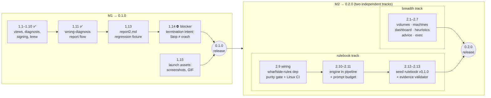

# Wharfside

[](https://github.com/wharfside/wharfside/actions/workflows/ci.yml)

**The AI-native container manager for macOS.**

Wharfside is a native SwiftUI desktop app for managing containers built on Apple's
[`apple/container`](https://github.com/apple/container) runtime — with on-device
intelligence powered by Apple's
[Foundation Models](https://developer.apple.com/documentation/foundationmodels) framework.

Ask it *why a container crashed* and get a diagnosis. Type *"stop everything using more
than 2 GB"* and it does. All of it runs on-device: no API keys, no cloud, no data ever
leaves your Mac.

## Why Wharfside

Several good GUIs exist for `apple/container`. Wharfside is different in one way that
matters: it pairs a full-featured manager with the on-device LLM that ships with
Apple Intelligence.

- 🩺 **Crash diagnosis** — one click on a failed container produces a root-cause
  summary, category, and concrete next steps, generated on-device from a digest of its
  logs and state
- ⌘K **Natural-language commands** — a command palette that resolves requests like
  *"restart the noisy one"* or *"show me postgres logs"* into real operations, with
  confirmation before anything destructive
- 📈 **Honest recommendations** — deterministic heuristics flag idle CPU allocations,
  memory-growth trends, and crash loops; the model prioritizes and explains them.
  Heuristics are labeled heuristics — only LLM output is labeled AI
- 📖 **Diagnosis that learns** — deterministic rules (facts, noise filters, evidence
  requirements) live in a versioned, signed rulebook; lessons from verified
  misdiagnoses ship to every installation without an app release
- 🔒 **Private by design** — every AI feature uses the FoundationModels framework.
  Nothing is sent to any server, and the app is fully functional (minus the AI tier)
  when Apple Intelligence is unavailable

## Features

Wharfside ships in milestone increments — see [PLAN.md](PLAN.md) for issue-level
detail.

**Milestone 1 — MVP (0.1)**
- 🐳 **Containers** — list, start/stop/delete, inspect (read-only detail in 0.1)
- 📦 **Images** — list, pull, tag, delete; registry login
- 🔍 **Logs** — streaming viewer with follow-tail, search, level colorization
- 🩺 **Crash diagnosis** — one-click root-cause summary from a log digest (hero feature)
- 📋 **Wrong-diagnosis reports** — one click copies the exact digest the model saw, so
  a bad diagnosis can become a regression fixture

**Milestone 2 — Depth (0.2)**
- 💾 **Volumes** — create, delete, attach info
- 🖥️ **Machines** — manage host VMs
- 📊 **Dashboard** — CPU/memory charts (Swift Charts)
- 📈 **Resource recommendations** — heuristic detectors + AI advice tier
- ⚡ **Exec/shell** — interactive terminal into a container
- 📖 **Diagnosis rulebook** — data-driven prechecks, noise demotion, prompt rules, and
  evidence validation (engine: [`wharfside-rules`](https://github.com/wharfside/wharfside-rules))

**Milestone 2.5 — Knowledge flywheel (0.2.x)**
- 🔄 **Signed rulebook updates** — new diagnosis rules delivered between app releases,
  Ed25519-verified, with a bundled fallback
- 🤝 **One-click misdiagnosis submission** — opt-in, previewed, on-device-scrubbed;
  raw logs never leave your Mac

**Milestone 3 — Command palette (0.3)**
- ⌘K **Natural-language commands** — tool calling with confirmation before destructive ops

**Always**
- 🔒 **Private by design** — on-device Foundation Models; fully functional minus AI when
  Apple Intelligence is off
- ⚡ **Native** — SwiftUI throughout; small footprint, sub-second launch

## Requirements

- **macOS 26+** on Apple silicon (required by `apple/container` itself)
- **apple/container** installed (`brew install --cask container` or the
  [signed installer](https://github.com/apple/container/releases))
- **Apple Intelligence enabled** — for AI features only; everything else works without it
- **Development**: Xcode 26+, Swift 6

## Getting started

```bash
# Clone the repository
git clone https://github.com/wharfside/wharfside.git
cd wharfside

# Lint, build, and test (same as CI)
make ci

# Or individually
make build   # xcodebuild, warnings as errors
make test    # app unit tests + WharfsideAnalysis
make lint    # SwiftLint --strict
```

On first launch Wharfside locates the `container` CLI (default `/usr/local/bin/container`),
starts the system service if needed, and checks Foundation Models availability. If Apple
Intelligence is off, AI panels explain how to enable it — nothing else is blocked.

## Architecture

**MVVM** with a strict separation between deterministic logic and AI synthesis:

- **Views** — SwiftUI
- **ViewModels** — state management (`@Observable`, async/await)
- **Services** — `ContainerServicing` protocol with XPC + CLI-fallback implementations
  (see [Spikes/XPC_CAPABILITY_MAP.md](Spikes/XPC_CAPABILITY_MAP.md))
- **Analysis layer** — `WharfsideAnalysis` SPM package: pure-Swift log digestion,
  pattern clustering, and resource statistics; fully unit-tested, works without any model.
  From 0.2, also hosts the rulebook engine
  ([`RulebookCore`](https://github.com/wharfside/wharfside-rules)) — deterministic rule
  selection, never model-driven (see [RULEBOOK_INTEGRATION.md](RULEBOOK_INTEGRATION.md))
- **AI layer** — `LanguageModelSession` with guided generation (`@Generable` typed
  outputs) for diagnosis and advice, and tool calling for the command palette.
  Destructive tool calls are queued for user confirmation — the model never mutates
  state directly

See [SPECIFICATION.md](SPECIFICATION.md) for the full product specification,
[PLAN.md](PLAN.md) for the development roadmap,
[AI_INTEGRATION.md](AI_INTEGRATION.md) for the Foundation Models design, and
[RULEBOOK_INTEGRATION.md](RULEBOOK_INTEGRATION.md) for the rulebook design.

## Roadmap

Detailed issue breakdown: [PLAN.md](PLAN.md).

| Milestone | Target | Focus |
|-----------|--------|-------|
| **M0 — Foundation** | done | CI, XPC spike, `ContainerServicing`, app shell, landing page |
| **M1 — MVP (0.1)** | in progress | Containers, images, logs + crash diagnosis; signing, Homebrew, launch |
| **M2 — Depth (0.2)** | ~4–5 weeks | Volumes, machines, dashboard, recommendations, exec/shell + rulebook core |
| **M2.5 — Flywheel (0.2.x)** | ~2–3 weeks | Signed rulebook distribution, misdiagnosis intake |
| **M3 — Moat (0.3)** | ~4–6 weeks | ⌘K command palette with tool calling; multi-container correlation |

### Delivery: path to 0.1 and 0.2



M1's release gate is 1.14: the hero feature must never diagnose a user-clicked **Stop**
as a crash. M2's two tracks are independently cuttable — either can ship 0.2.0 alone if
capacity demands.

**Deferred past v0.x**: cross-platform, compose-style orchestration, cloud AI fallback,
Mac App Store distribution, image builds UI (runtime 1.0 has no XPC build route).

## Feedback

Diagnosis wrong? On the diagnosis card, click **Copy report** (or use its right-click
menu) to grab a reproduction bundle — the digest the model saw, its diagnosis, and
version info — then paste it into the
[wrong-diagnosis issue template](https://github.com/wharfside/wharfside/issues/new?template=wrong-diagnosis.yml).
Every report becomes a candidate regression fixture — and, from 0.2, a candidate rule in
the shared diagnosis rulebook. Review the pasted report first — digests can contain log
fragments with secrets.

## Contributing

Contributions are welcome. See [PLAN.md](PLAN.md) for the current milestone and scope;
`CONTRIBUTING.md` ships with the 0.1 release.

## License

MIT License — see [LICENSE](LICENSE).

## Related projects

- [apple/container](https://github.com/apple/container) — the container runtime Wharfside manages
- [apple/containerization](https://github.com/apple/containerization) — the underlying framework
- [FoundationModels](https://developer.apple.com/documentation/foundationmodels) — Apple's on-device LLM framework
- [wharfside/wharfside-rules](https://github.com/wharfside/wharfside-rules) — the rulebook engine (RulebookCore)

## Status

🚧 **M1 — MVP in progress**; M0 complete (see [PLAN.md](PLAN.md)).

| # | Issue | Status |
|---|-------|--------|
| 1.1–1.10 | Views, log pipeline, diagnosis, signing, Homebrew | ✅ Done |
| 1.11 | Wrong-diagnosis report flow ("Copy report" → fixture) | ✅ Done |
| 1.13 | report2.md stop-vs-OOM regression fixture | ⏳ Next |
| 1.14 | Termination-intent fact (Stop ≠ crash) — **release blocker** | Pending |
| 1.15 | Launch assets: README screenshots, demo GIF | Pending |
| 1.12 | 0.1.0 release + launch posts | Pending (requires 1.14) |

**M1 exit criteria**: a stranger on macOS 26 can `brew install` Wharfside, manage
containers, and get a useful crash diagnosis — and stopping a container is never
diagnosed as a crash.

---

**Platform**: macOS 26+ (Apple silicon) · **Language**: Swift + SwiftUI · **AI**: on-device only